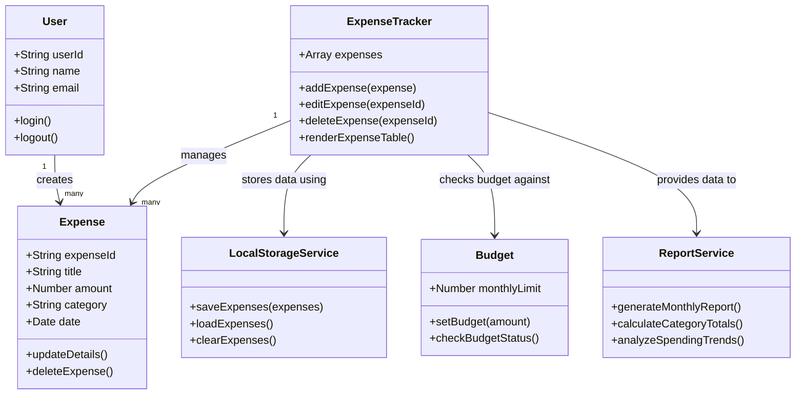

# Class Diagram

```mermaid
classDiagram
    class User {
        +String userId
        +String name
        +String email
        +login()
        +logout()
    }

    class Expense {
        +String expenseId
        +String title
        +Number amount
        +String category
        +Date date
        +updateDetails()
        +deleteExpense()
    }

    class ExpenseTracker {
        +Array expenses
        +addExpense(expense)
        +editExpense(expenseId)
        +deleteExpense(expenseId)
        +renderExpenseTable()
    }

    class LocalStorageService {
        +saveExpenses(expenses)
        +loadExpenses()
        +clearExpenses()
    }

    class Budget {
        +Number monthlyLimit
        +setBudget(amount)
        +checkBudgetStatus()
    }

    class ReportService {
        +generateMonthlyReport()
        +calculateCategoryTotals()
        +analyzeSpendingTrends()
    }

    User "1" --> "many" Expense : creates
    ExpenseTracker "1" --> "many" Expense : manages
    ExpenseTracker --> LocalStorageService : stores data using
    ExpenseTracker --> Budget : checks budget against
    ExpenseTracker --> ReportService : provides data to
```
