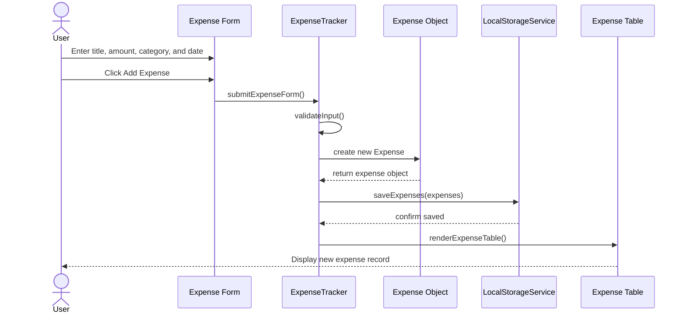

# Sequence Diagram: Add Expense

```mermaid
sequenceDiagram
    actor User
    participant Form as Expense Form
    participant Tracker as ExpenseTracker
    participant Expense as Expense Object
    participant Storage as LocalStorageService
    participant Table as Expense Table

    User->>Form: Enter title, amount, category, and date
    User->>Form: Click Add Expense
    Form->>Tracker: submitExpenseForm()
    Tracker->>Tracker: validateInput()
    Tracker->>Expense: create new Expense
    Expense-->>Tracker: return expense object
    Tracker->>Storage: saveExpenses(expenses)
    Storage-->>Tracker: confirm saved
    Tracker->>Table: renderExpenseTable()
    Table-->>User: Display new expense record
```
